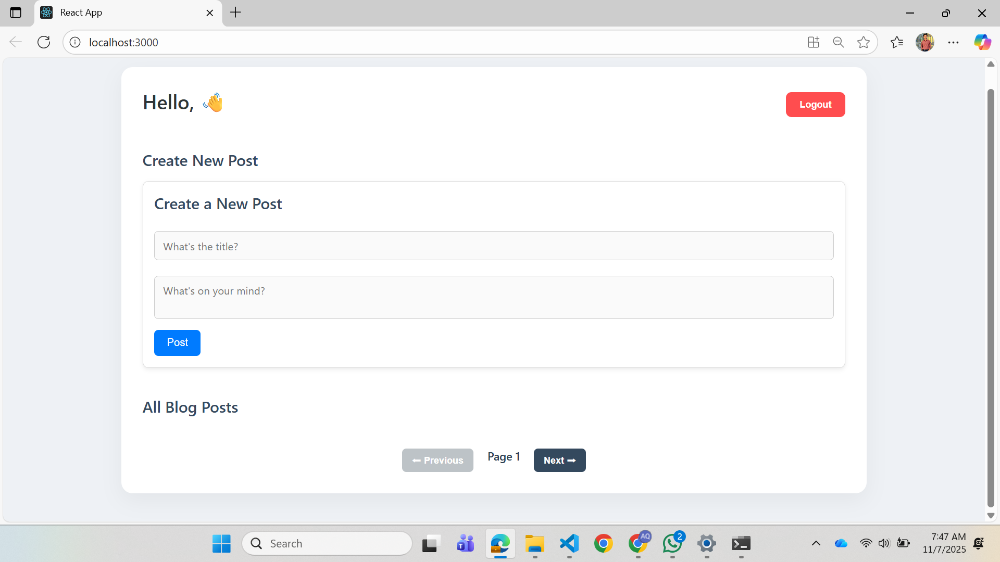
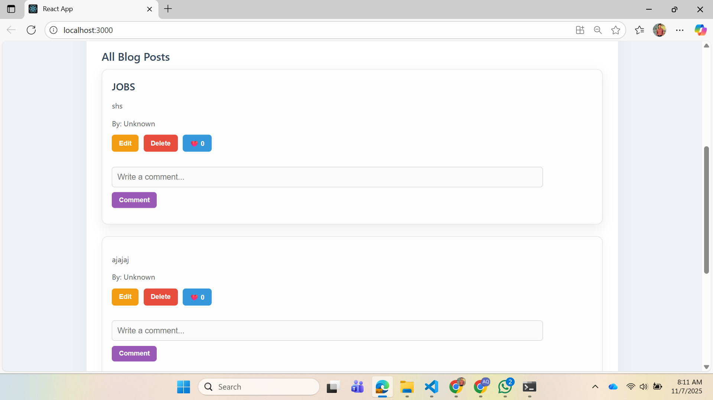
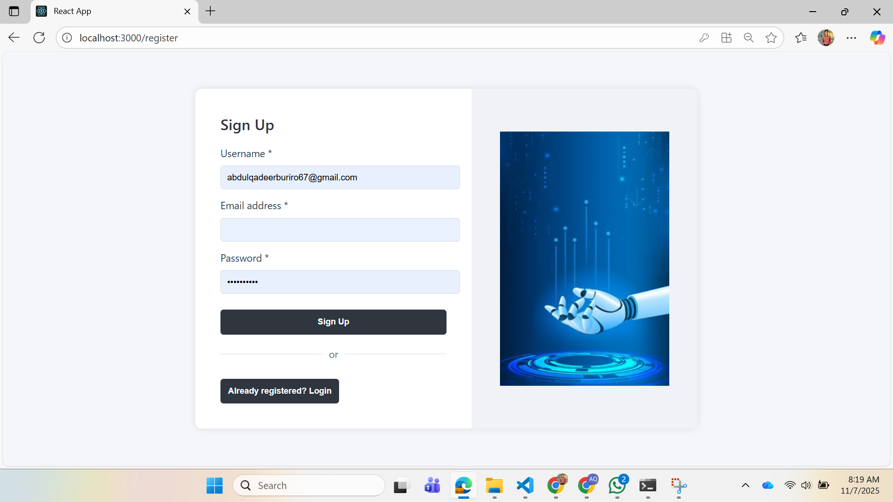
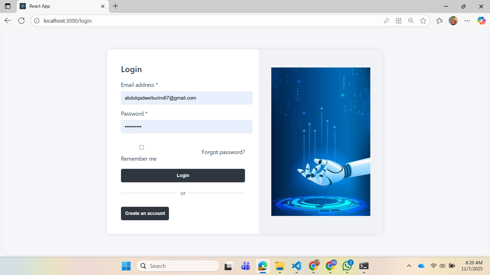

# 🌐 Social Dashboard

A modern and feature-rich **social dashboard application** that allows users to **create, update, delete, and read posts**.  
Users can also **like and comment** on posts shared by others — all in a smooth, responsive interface.

---

## 🚀 Features

### 👤 User Features
- 🔐 **Authentication:** Secure sign up, login, and logout
- 📝 **Post Management:** Create, read, update, and delete posts
- ❤️ **User Interaction:** Like and comment on posts
- 🧑‍💻 **Profile:** Manage personal profile and view others’ posts

### ⚙️ Other Features
- 📱 **Responsive UI:** Optimized for both desktop and mobile
- 🔄 **Real-Time Updates:** Posts, likes, and comments update instantly
- 🔍 **Clean Design:** Simple and modern layout for great UX

---

## 🧰 Tech Stack

| Layer | Technology |
|-------|-------------|
| **Frontend** | React.js |
| **Backend** | Node.js, Express.js |
| **Database** | MongoDB |
| **Authentication** | JWT Authentication |
| **Hosting** | GitHub Pages |

---

💻 Usage Guide
🧾 Sign up / Login to your account.

✍️ Create new posts and share updates.

✏️ Edit or delete your posts any time.

💬 Like and comment on other users’ posts.

🕵️ View all posts on the dashboard in real time.

📸 Screenshots
### 🏠 Dashboard View

### 📝 Create Post Page

### 💬 Comments Section

### 👤 User Profile

(Save your screenshots in an assets/ folder and name them as above — or adjust filenames as needed.)

🤝 Contributing
Contributions are welcome!

Fork the repository

Create a feature branch

👨‍💻 Developer
Developed by AQ Khan
📧 Contact: abdulqadeerburiro110@gmail.com
💼 Portfolio: [yourwebsite.com](https://abdul-qadeer-buriro.netlify.app/)

⭐ Show your support
If you like this project, please star the repo on GitHub — it helps others find it and motivates further development 💙
